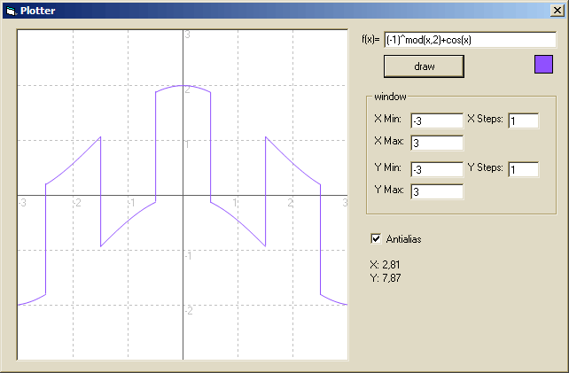



## function plotter

### Description

A function plotter with GDI+ anti-aliasing.

Handles brackets, functions and variables.

Note: This needs a GDI+ type library which is included in the zip archive.

Make sure it's referenced in the project.

// 20. feb 07: added missing type lib "bstrapi.tlb".

// 20. feb 07: wrong axes labeling fixed
 
### More Info
 

             |
---                |---
**Submitted On**   |2003-02-06 23:40:34
**By**             |[Arne Elster](https://github.com/Planet-Source-Code/PSCIndex/blob/master/ByAuthor/arne-elster.md)
**Level**          |Intermediate
**User Rating**    |5.0 (35 globes from 7 users)
**Compatibility**  |VB 6\.0
**Category**       |[Graphics](https://github.com/Planet-Source-Code/PSCIndex/blob/master/ByCategory/graphics__1-46.md)
**World**          |[Visual Basic](https://github.com/Planet-Source-Code/PSCIndex/blob/master/ByWorld/visual-basic.md)
**Archive File**   |[function\_p2048952202007\.zip](https://github.com/Planet-Source-Code/arne-elster-function-plotter__1-67903/archive/master.zip)

